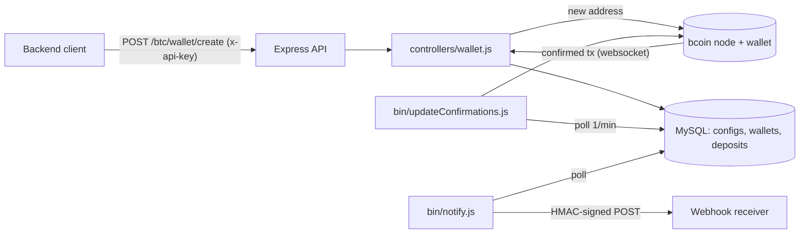

# btc-wallet-service

A small Bitcoin deposit-watching service. It manages a watch-only wallet on a [bcoin](https://github.com/bcoin-org/bcoin) full node (derived from an extended public key), hands out fresh deposit addresses over an HTTP API, detects incoming payments, tracks confirmations, and notifies a configured webhook (HMAC-signed) once a deposit reaches the minimum confirmation count.

The service is watch-only: it never holds private keys.

> Reference code, not audited. Do not use with real funds without your own review.

## Architecture

## Stack

Node.js, Express 4, Sequelize 6 + MySQL (mysql2), bcoin 2.0 (NodeClient / WalletClient), express-rate-limit, dotenv.

## Supported chains

Bitcoin mainnet and testnet (`BCOIN_NETWORK`). On testnet the API routes are prefixed with `/test`.

## Setup

1. Run a bcoin 2.0 node with the wallet and HTTP API enabled.
2. Create the MySQL database from `models/schema.sql` (schema only, no data).
3. Seed the `configs` table with these keys: `bcoin_wallet_id`, `legacy_xpub` (mainnet) and/or `testnet_xpub`, `minConfirmations`, `notifyUrl`, `latestBlockNumber`.
4. `cp .env.example .env` and fill in the values.
5. `npm install && node server.js` (there is no `start` script and `npm test` is a stub).

Example requests are in `test/*.curl` (replace the `REDACTED_*` placeholders).

## Environment variables

| Name | Purpose |
|---|---|
| PORT | HTTP port of this service |
| DB_HOST, DB_PORT, DB_SCHEMA, DB_USER, DB_PASSWORD | MySQL connection |
| DEBUG | `true` enables SQL logging |
| API_KEY | Expected value of the `x-api-key` request header |
| API_SECRET | HMAC-SHA256 secret for webhook signatures (`x-wallet-server-signature`) |
| NOTIFY_SLEEP | Seconds between notifier runs |
| BCOIN_NETWORK | `main` or `testnet` |
| BCOIN_HOST | bcoin host |
| BCOIN_WALLET_PORT, BCOIN_WALLET_API_KEY | bcoin wallet HTTP API |
| BCOIN_NODE_PORT, BCOIN_NODE_API_KEY | bcoin node HTTP API |

## API

All requests require the `x-api-key` header and are rate limited to 1000 requests per minute.

- `POST /btc/wallet/create` returns `{ address }`
- `POST /btc/wallet/resync` with body `{ "block": N }` resets the node chain state to block N-1 and returns `{ success, block }`
- anything else returns 400 "Unknown Request"

Webhook payload: `{ type: "DEPOSIT", network: "BITCOIN", hash, from, to, value }`.

## Security note

The `/resync` endpoint is destructive and protected only by the shared API key (compared with `==`). Run this service behind network-level protection (private network, firewall or VPN) and do not expose it to the public internet.

## Context

Written in spring 2022 as the Bitcoin deposit backend for an app/exchange-style deposit flow. Timestamps in `bin/utils/utils.js` use a fixed UTC+8 offset.

## License

MIT
